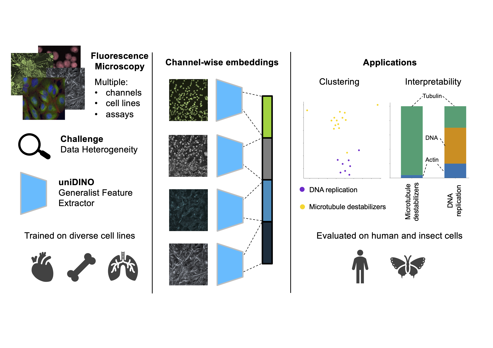

# uniDINO: assay-independent feature extraction for fluorescence microscopy images
*Authors: Flavio M. Morelli, Vladislav Kim, Franziska Hecker, Sven Geibel, Paula A. Marin Zapata*

This repository contains the code used for training, inference, and evaluation of the model  presented in the manuscript "uniDINO: Assay-independent feature extraction for fluorescence microscopy images". The code is partially based on [this repo](https://github.com/Bayer-Group/CellPaintSSL.git).

**All instructions assume that the working directory is the cloned repo**

## 0. Overview
High-content imaging (HCI) enables the characterization of cellular states through the extraction of quantitative features from fluorescence microscopy images. Despite the widespread availability of HCI data, the development of generalizable feature extraction models remains challenging due to the heterogeneity of microscopy images, as experiments often differ in channel count, cell type, and assay conditions. To address these challenges, we introduce uniDINO, a generalist feature extraction model capable of handling images with an arbitrary number of channels. We train uniDINO on a dataset of over 900,000 single-channel images from diverse experimental contexts and concatenate single-channel features to generate embeddings for multi-channel images. Our extensive validation across varied datasets demonstrates that uniDINO outperforms traditional computer vision methods and transfer learning from natural images, while also providing interpretability through channel attribution. uniDINO offers an out-of-the-box, computationally efficient solution for feature extraction in fluorescence microscopy, with the potential to significantly accelerate the analysis of HCI datasets.



## 1. Conda environment (Linux, CUDA)
We provide a conda environment for Linux with CUDA (x86_64 architecture). Model training can only be conducted in a Linux environment with NVIDIA GPUs.

The conda environment is defined in `unidino_csbj.yml`. To create and activate a conda environment for training, inference and evaluation run the following commands:
```
conda env create -f unidino_csbj.yml
conda activate unidino-csbj
```
To speed up installation you can use [mamba](https://mamba.readthedocs.io/en/latest/index.html) as a drop-in replacement of `conda`.
**Note**: Make sure to adjust the CUDA version (`cu111`) for installing PyTorch in `unidino.yml`. To determine your CUDA version, run `nvidia-smi | grep CUDA`.

## 2. Download model checkpoints, images and embeddings
Model weights (provided under a non-commercial license), embeddings and example data (one plate from the JUMPCP dataset) can be found on Zenodo.

## 3. Setting the paths

Our codebase keeps track of all the path in `source/path.py`. The root paths may need to be adjusted, especially `HCA_DATA_LAKE`. We assume that the extracted embeddings are in `./embeddings` and that the figures and tables will be saved in the respective folder of `./figures`

## 4. Dataloader format

Data loading is an essential part of uniDINO (`source/io.py`) due to dataset heterogeneity and to the differing behaviors of training and inference. During training we load single-channels chosen at random from a random image in a random data set. During inference, we need all the channels of an image to create an embedding. A simple example is given in `./example_data/example_metadata`, and in the `ExampleJUMPCPMetadata` class in `source/io.py`.


### 4.1. The `Dataset` class
The `Dataset` class in `source/io.py` abstracts the data loading. It provides functionality to deal with images with merged channels, and also to load single or multi-channel data. It is unlikely that you will need to adapt this class.

### 4.2. The `Metadata` class
The `Dataset` relies on the `Metadata` class in `source/io.py`, which hides away the complexity of dealing with diverse datasets. To use you dataset with uniDINO, you will need to write your own subclass inheriting from `Metadata`. The `Metadata` parent class contains the method `validate` that ensures that all necessary features are fulfilled for `Dataset` to work correctly.

A `Metadata` class needs to include the following attributes:
* `metadata: pd.DataFrame`: A metadata data frame containing metadata information for the dataset
* `single_channel_metadata : bool`: This indicates whether the metadata is is a single-channel or multi-channel format
* `is_merged: bool`: Indicated whether the images consist of merged channels into a single file or single channels saved as separate files
* `inference_metadata_columns: list(str)`: A list of column names that are required for inference and should be present in the metadata

The `metadata` data frame has to contain a column called `path`, which contains the absolute path to the file. The exact format of `path` depends on how the data is stored and whether the loading is for training or inference.

Let's assume that the channels are stored as separate single files. In this case, it is necessary to have one row per image for training and a list of paths for all channels for inference. On the other hand, if the images are stored as merged files, the `path` column will contain only the absolute path to the merged image. However, for training you need to preprocess the paths as showcased in the `_convert_metadata_to_single_channel` function for `JUMPCPMetadata`.

## 4.3 Data loading during training vs. inference

During training, multiple datasets are passed to the model. We achieve this by concatenating multiple datasets before passing it to the dataloader. This is showcased in the `get_concatenated_datasets` function in `source/io.py`. For inference, we pass the `Dataset` for the given data directly to the dataloader.

## 5. Training SSL models on NVIDIA GPUs
**Note that training is only supported in a Linux environment with NVIDIA GPUs.**

We trained uniDINO on five NVIDIA Tesla-V100 GPU's with 32GB GPU memory using PyTorch's `DistributedDataParallel` multi-GPU paradigm. You might have to adjust the number of GPUs to avoid memory issues. However, it is highly recommended to keep the total batch size (`batch_size_per_gpu * number of  gpus`) close to 510. Further details on setting the batch size can be found [here](https://github.com/google-research/tuning_playbook?tab=readme-ov-file#choosing-the-batch-size).

An example of how to run training can be found in `run_dino.sh`. After adjusting the parameters the parameters to your needs, run `bash run_dino.sh` to start the training.

Here's a breakdown of the different arguments and options used:

+ `export CUDA_VISIBLE_DEVICES=0,1`: Sets the CUDA visible devices to GPU devices 0 and 1.
+ `--arch`: Specifies the architecture of the DINO model (e.g. ViT-S).
+ `--lr`: Sets the base learning rate for training.
+ `--epochs`: Sets the total number of training epochs.
+ `--freeze_last_layer`: Freezes the last layers during training.
+ `--warmup_teacher_temp_epochs 20 --warmup_teacher_temp 0.01`: Applies a warm-up schedule to the teacher temperature, gradually increasing it from 0.01 to the desired value over the specified number of epochs.
+ `--norm_last_layer true`: Enables normalization of the last layer of the model.
+ `--use_bn_in_head false`: Disables the use of batch normalization in the model's head.
+ `--momentum_teacher`: Sets the momentum factor for updating the teacher network's parameters.
+ `--warmup_epochs`: Sets the number of learning rate warm-up epochs.
+ `--use_fp16 false`: Disables mixed precision training using half-precision (float16).
+ `--batch_size_per_gpu`: Sets the batch size per GPU during training.
+ `--num_workers`: Specifies the number of worker processes for data loading.
+ `--output_dir`: Sets the output directory where the checkpoints and training logs will be saved.


## 6. Feature extraction using SSL models
To run inference on using uniDINO, use `run_dino_inference.sh`, choosing the checkpoint the validation set and the output directory. Possible values for the validation set `--valset` include `jumpcp-valset`, `cell-health`, `BBBC021`, `HPA`, `BBBC037`, `insect`, `example_data`.

## 7. Evaluation of representations
We provide the analysis scripts for the following datasets: BBBC021, JUMP-CP Target-2, Cell Health, Insect. The CSV files and PDFs are saved in the same folder for each dataset. The scripts can be found in the `./figures` folder. There is a subfolder for each dataset, which contains the python script to run the analysis: `python <scriptname>.py`.

## 8. Data availability

* BBBC021: available from https://bbbc.broadinstitute.org/BBBC021
* BBBC037: available from https://bbbc.broadinstitute.org/BBBC037
* HPA: download instructions here https://www.kaggle.com/code/lnhtrang/hpa-public-data-download-and-hpacellseg/notebook
* JUMPCP: available from https://broadinstitute.github.io/jump_hub/
* Insect: https://www.sciencedirect.com/science/article/pii/S0048357524002165#da0005
* CellHealth: https://github.com/broadinstitute/cell-health
* Cardio: private dataset

## 9. License
The code is distributed under the BSD 3-Clause License, which grants users the freedom to use, modify, and distribute the code with certain obligations and limitations. Please refer to the LICENSE file for detailed information regarding the terms and conditions.

The model weights provided in `SSL_data/checkpoints` are intended for non-commercial use only. These model weights are licensed under the Creative Commons Attribution-NonCommercial 4.0 International (CC BY-NC 4.0) [license](https://creativecommons.org/licenses/by-nc/4.0/legalcode).